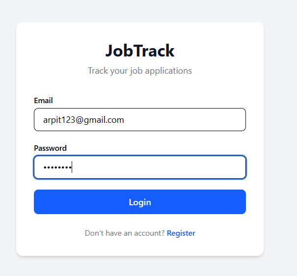
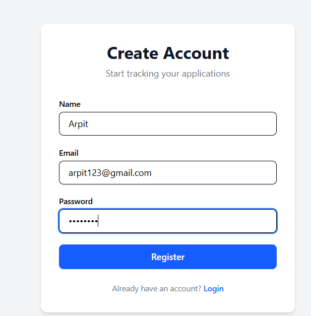
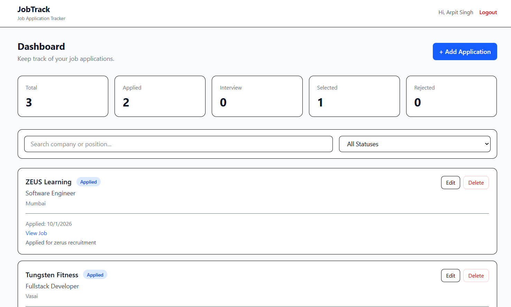
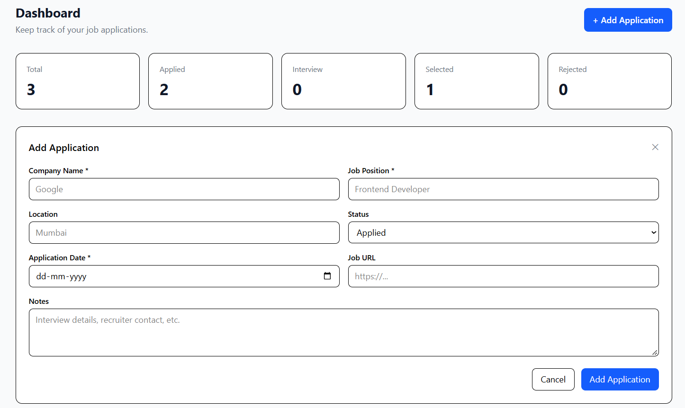
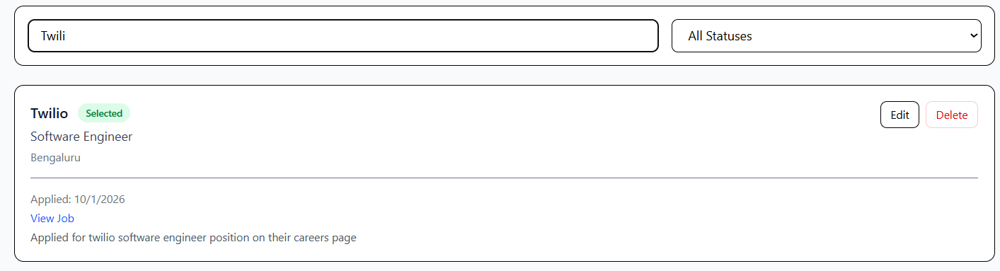

# 🎯 Job Application Tracker

A full-stack web application for tracking and managing job applications in one place.

Built from scratch using **React, Node.js, Express.js, MongoDB, JWT, and REST APIs**.

---

## 📖 Table of Contents

- [Live Demo](#-live-demo)
- [Screenshots & Results](#-screenshots--results)
- [Features](#-features)
- [Tech Stack](#-tech-stack)
- [Application Status](#-application-status)
- [Project Structure](#-project-structure)
- [API Endpoints](#-api-endpoints)
- [Authentication Flow](#-authentication-flow)
- [Data Model](#-data-model)
- [Dashboard](#-dashboard)
- [Running Locally](#-running-locally)
- [Security](#-security)
- [Key Learning Outcomes](#-key-learning-outcomes)
- [Future Improvements](#-future-improvements)
- [License](#-license)

---


---

## 📸 Screenshots & Results

## Screenshots & Results

### Login



### Register



### Dashboard



### Add / Edit Application



### Search & Filter



---

## ✨ Features

### Authentication

- User registration and login
- JWT-based authentication
- bcrypt password hashing
- Protected API routes

### Job Applications

- Create job applications
- View job applications
- Edit job applications
- Delete job applications
- Search applications by company or job position
- Filter applications by status
- Dashboard statistics
- Responsive user interface
- User-specific application data

---

## 🛠️ Tech Stack

| Layer | Technologies |
| --- | --- |
| Frontend | React, Vite, Tailwind CSS, React Router, JavaScript |
| Backend | Node.js, Express.js, MongoDB, Mongoose, JWT, bcryptjs |
| API | REST API, JSON |

---

## 🏷️ Application Status

Each job application can have one of the following statuses:

| Status |
| --- |
| **Applied** |
| **Interview** |
| **Selected** |
| **Rejected** |

> The dashboard automatically displays the count of applications in each status.

---

## 📁 Project Structure

```text
job-application-tracker/
│
├── client/
│   ├── src/
│   │   ├── components/
│   │   │   ├── Navbar.jsx
│   │   │   ├── StatsCard.jsx
│   │   │   ├── ApplicationForm.jsx
│   │   │   └── ApplicationCard.jsx
│   │   │
│   │   ├── pages/
│   │   │   ├── Login.jsx
│   │   │   ├── Register.jsx
│   │   │   └── Dashboard.jsx
│   │   │
│   │   ├── services/
│   │   │   └── api.js
│   │   │
│   │   ├── App.jsx
│   │   ├── main.jsx
│   │   └── index.css
│   │
│   └── package.json
│
├── server/
│   ├── config/
│   │   └── db.js
│   │
│   ├── controllers/
│   │   ├── authController.js
│   │   └── applicationController.js
│   │
│   ├── middleware/
│   │   └── authMiddleware.js
│   │
│   ├── models/
│   │   ├── User.js
│   │   └── Application.js
│   │
│   ├── routes/
│   │   ├── authRoutes.js
│   │   └── applicationRoutes.js
│   │
│   ├── .env
│   ├── .gitignore
│   ├── server.js
│   └── package.json
│
├── .gitignore
└── README.md
```

---

## 🔌 API Endpoints

### 🔐 Authentication

| Method | Endpoint | Description |
| --- | --- | --- |
| `POST` | `/api/auth/register` | Register a user |
| `POST` | `/api/auth/login` | Login |
| `GET` | `/api/auth/me` | Get current user |

### 📋 Applications

| Method | Endpoint | Description |
| --- | --- | --- |
| `POST` | `/api/applications` | Create application |
| `GET` | `/api/applications` | Get user's applications |
| `PUT` | `/api/applications/:id` | Update application |
| `DELETE` | `/api/applications/:id` | Delete application |

---

## 🔑 Authentication Flow

### User Registration

```text
User Registration
        ↓
Password received by API
        ↓
bcrypt hashes password
        ↓
User stored in MongoDB
```

### User Login

```text
User Login
        ↓
Express API
        ↓
Find user by email
        ↓
bcrypt verifies password
        ↓
Generate JWT
        ↓
Return token
        ↓
Frontend stores token
        ↓
Token sent with protected requests
        ↓
JWT middleware verifies token
        ↓
Authenticated request continues
```

---

## 🗃️ Data Model

### User

```text
User
├── name
├── email
└── password
```

> Passwords are stored as bcrypt hashes rather than plain text.

### Application

```text
Application
├── userId
├── companyName
├── jobPosition
├── location
├── status
├── applicationDate
├── jobUrl
├── notes
├── createdAt
└── updatedAt
```

> Each application is associated with the user who created it through `userId`.

### User Data Isolation

Application operations are scoped to the authenticated user's ID.

For example:

```text
JWT
 ↓
Verified user ID
 ↓
req.user
 ↓
Application query
 ↓
Only that user's applications are returned
```

> This prevents users from accessing or modifying applications belonging to another user.

---

## 📊 Dashboard

The dashboard provides a quick overview of the user's job search activity.

### Statistics

- Total applications
- Applied applications
- Interview applications
- Selected applications
- Rejected applications

### Actions

- Search by company
- Search by position
- Filter by application status
- Add application
- Edit application
- Delete application

---

## 💻 Running Locally

### 1️⃣ Clone the repository

```bash
git clone https://github.com/arpitsingh39/job-application-tracker.git
cd job-application-tracker
```

### 2️⃣ Start the backend

```bash
cd server
npm install
```

Create a `.env` file inside the `server` folder:

```env
PORT=5000
MONGO_URI=your_mongodb_connection_string
JWT_SECRET=secret_key
```

Start the backend:

```bash
npm run dev
```

The backend will run on:

```text
http://localhost:5000
```

### 3️⃣ Start the frontend

Open another terminal:

```bash
cd client
npm install
npm run dev
```

The frontend will run on:

```text
http://localhost:5173
```

---

## 🔒 Security

- Passwords are hashed using **bcrypt** before being stored
- **JWT** is used for authentication
- Protected routes require a valid JWT
- Application queries are scoped to the authenticated user's ID
- Sensitive environment variables are stored in `.env`
- `.env` and `node_modules` are excluded from version control

---

## 🎓 Key Learning Outcomes

This project helped me strengthen my understanding of:

- React component-based development
- React state management
- React Router
- REST API design
- Express.js routing and middleware
- JWT authentication
- Password hashing with bcrypt
- MongoDB and Mongoose
- CRUD operations
- Protected API endpoints
- User-specific data access
- Frontend and backend integration

---

## 🔮 Future Improvements

Possible future improvements include:

- [ ] Pagination for large numbers of applications
- [ ] Application analytics and charts
- [ ] Interview reminders
- [ ] Email notifications
- [ ] Resume/document attachments
- [ ] OAuth authentication
- [ ] Backend-side search, filtering, sorting, and pagination

---

## 📄 License

This project is created for learning and educational puropses.